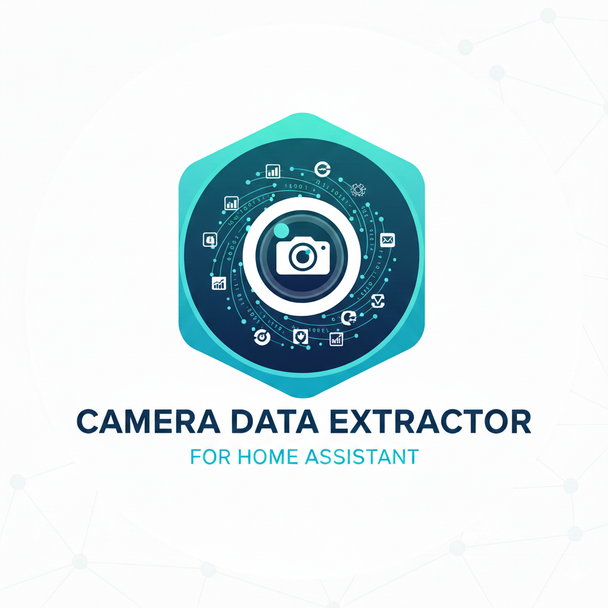

<p align="center">
  
</p>

<h1 align="center">Camera OCR for Home Assistant</h1>

<p align="center">
  
  
  
  
  
  
</p>

<p align="center">
  <a href="https://my.home-assistant.io/redirect/hacs_repository/?owner=tursoft&repository=hass-camera-ocr&category=integration">
    
  </a>
  <a href="https://my.home-assistant.io/redirect/supervisor_add_addon_repository/?repository_url=https%3A%2F%2Fgithub.com%2Ftursoft%2Fhass-camera-ocr">
    
  </a>
</p>

Extract numeric values from IP camera video streams using OCR (Optical Character Recognition). Perfect for monitoring displays like boiler temperatures, pressure gauges, energy meters, or any device with a digital/analog display.

## Features

- **Video Stream Support**: Connect to RTSP and HTTP video streams from IP cameras
- **OCR Value Extraction**: Automatically extract numeric values from camera images
- **Region of Interest (ROI)**: Define specific areas of the frame to analyze
- **Template Matching**: Handle camera movement/rotation by using reference templates
- **PTZ Controls**: Pan, Tilt, and Home position controls for ONVIF cameras
- **Auto-Discovery**: Discover ONVIF-compatible cameras on your network
- **AI Integration**: Optional AI-powered OCR enhancement and scene description (OpenAI, Anthropic, Google, Ollama)
- **Web UI Panel**: Easy-to-use interface for configuration and ROI selection
- **Home Assistant Integration**: Exposes values as sensor entities for automations and monitoring
- **Two Installation Methods**: Available as both a Custom Integration and an Add-on

## Screenshots

### Main Dashboard
View all configured cameras and their extracted values at a glance.


### ROI Selection
Easily select the region of interest by clicking and dragging on the camera frame.


### Camera Configuration
Configure camera settings, preprocessing options, and scan intervals.


## Installation

Choose one of the following installation methods based on your needs:

| Method | Best For | Requires |
|--------|----------|----------|
| **Add-on** | Home Assistant OS / Supervised | Nothing extra |
| **Custom Integration** | Any HA installation | Tesseract OCR on host |

---

### Method 1: Add-on Repository (Recommended for HA OS)

This is the easiest method for Home Assistant OS and Supervised installations. The add-on runs in its own container with all dependencies included.

#### Quick Install

[](https://my.home-assistant.io/redirect/supervisor_add_addon_repository/?repository_url=https%3A%2F%2Fgithub.com%2Ftursoft%2Fhass-camera-ocr)

Click the button above, or follow the manual steps below:

#### Manual Install

1. Go to **Settings** → **Add-ons** → **Add-on Store**
2. Click the three dots menu (⋮) in the top right → **Repositories**
3. Add this repository URL:
   ```
   https://github.com/tursoft/hass-camera-ocr
   ```
4. Click **Add** → **Close**
5. Find "Camera OCR" in the add-on store and click it
6. Click **Install**
7. Configure your cameras in the **Configuration** tab
8. Start the add-on
9. Click **Open Web UI** to access the interface

#### Add-on Configuration Example

```yaml
cameras:
  - name: Boiler Temperature
    stream_url: rtsp://192.168.1.100:554/stream1
    username: admin
    password: your_password
    value_name: Temperature
    unit: °C
    roi_x: 100
    roi_y: 50
    roi_width: 200
    roi_height: 80
    preprocessing: auto
  - name: Pressure Gauge
    stream_url: http://192.168.1.101/video
    value_name: Pressure
    unit: bar
scan_interval: 30
log_level: info
```

---

### Method 2: HACS Custom Integration

For advanced users or non-OS installations who want sensor entities.

#### Quick Install

[](https://my.home-assistant.io/redirect/hacs_repository/?owner=tursoft&repository=hass-camera-ocr&category=integration)

Click the button above, or follow the manual steps below:

#### Manual Install

1. Open HACS in Home Assistant
2. Click the three dots menu (⋮) → **Custom repositories**
3. Add `https://github.com/tursoft/hass-camera-ocr` as an **Integration**
4. Search for "Camera OCR" and install
5. Restart Home Assistant
6. Go to **Settings** → **Devices & Services** → **Add Integration**
7. Search for "Camera OCR" and configure

### Method 3: Manual Installation

For manual installation without HACS.

1. Download the latest release from GitHub
2. Extract and copy the `custom_components/hass_camera_ocr` folder to your Home Assistant's `custom_components` directory
3. Restart Home Assistant

---

## Prerequisites (Custom Integration Only)

> **Note**: If you installed the **Add-on**, skip this section - all dependencies are included.

The custom integration requires **Tesseract OCR** to be installed on your Home Assistant system.

### Home Assistant OS / Supervised

Tesseract should be available automatically. If not, you may need to install it via the terminal add-on:

```bash
apk add tesseract-ocr
```

### Home Assistant Container

Add Tesseract to your Docker image or mount it from the host:

```bash
apt-get install tesseract-ocr
```

### Home Assistant Core

Install Tesseract on your system:

```bash
# Ubuntu/Debian
sudo apt-get install tesseract-ocr

# Fedora
sudo dnf install tesseract

# macOS
brew install tesseract
```

## Configuration

### Adding a Camera

1. Go to **Settings** → **Devices & Services** → **Add Integration**
2. Search for "Camera OCR"
3. Enter your camera details:
   - **Camera Name**: A friendly name for your camera
   - **Stream URL**: The RTSP or HTTP URL of your camera stream
     - RTSP example: `rtsp://192.168.1.100:554/stream1`
     - HTTP example: `http://192.168.1.100/video`
   - **Username/Password**: Optional credentials for camera authentication

4. Configure extraction settings:
   - **Value Name**: Name for the extracted value (e.g., "Temperature")
   - **Unit of Measurement**: Unit for display (e.g., "°C", "bar", "%")
   - **Scan Interval**: How often to capture and analyze frames (seconds)
   - **Preprocessing**: Image preprocessing method for better OCR accuracy

5. Set up the Region of Interest (ROI):
   - Set coordinates to define the area containing the value
   - Use the Web UI panel for visual selection (recommended)

### Using the Web UI Panel

After installation, a new **Camera OCR** panel appears in your Home Assistant sidebar.

1. **Cameras Tab**: View configured cameras and capture live frames
2. **ROI Selection Tab**:
   - Click and drag on the frame to select the region containing the value
   - Fine-tune using the coordinate inputs
   - Save as a template for cameras that may move
3. **Templates Tab**: Manage saved templates and test template matching
4. **Discovery Tab**: Scan your network for ONVIF cameras

### Template Matching (For Moving Cameras)

If your camera can pan/tilt/zoom, use template matching to find the correct region even when the camera moves:

1. Position your camera to show the display
2. Go to the ROI Selection tab
3. Select the region containing the value
4. Enter a template name and click "Save as Template"
5. Use the `hass_camera_ocr.use_template` service to update the ROI based on the current camera position

## Common Camera Stream URLs

| Brand | Typical RTSP URL |
|-------|-----------------|
| TP-Link Tapo | `rtsp://user:pass@IP:554/stream1` (HD) or `stream2` (SD) |
| Hikvision | `rtsp://user:pass@IP:554/Streaming/Channels/101` |
| Dahua | `rtsp://user:pass@IP:554/cam/realmonitor?channel=1&subtype=0` |
| Reolink | `rtsp://user:pass@IP:554/h264Preview_01_main` |
| Amcrest | `rtsp://user:pass@IP:554/cam/realmonitor?channel=1&subtype=0` |
| Ubiquiti | `rtsp://user:pass@IP:554/live` |
| Generic ONVIF | `rtsp://user:pass@IP:554/stream1` |

> **Note for Tapo cameras**: You must create a "Camera Account" in the Tapo app (Settings → Advanced Settings → Camera Account). Use these credentials for RTSP access, not your TP-Link account credentials.

## Services

### `hass_camera_ocr.capture_frame`

Immediately capture a frame and update the sensor value.

```yaml
service: hass_camera_ocr.capture_frame
data:
  entity_id: sensor.boiler_temperature
```

### `hass_camera_ocr.update_roi`

Update the Region of Interest coordinates.

```yaml
service: hass_camera_ocr.update_roi
data:
  entity_id: sensor.boiler_temperature
  roi_x: 100
  roi_y: 50
  roi_width: 200
  roi_height: 80
```

### `hass_camera_ocr.use_template`

Find and apply ROI from a saved template (for moving cameras).

```yaml
service: hass_camera_ocr.use_template
data:
  entity_id: sensor.boiler_temperature
  template_name: boiler_display
```

## Home Assistant Entities

The add-on automatically creates sensor entities in Home Assistant for each configured camera:

### Entity Naming

For a camera named "Boiler Temperature", the following entities are created:

| Entity ID | Description |
|-----------|-------------|
| `sensor.camera_ocr_boiler_temperature_value` | Numeric value extracted (float) |
| `sensor.camera_ocr_boiler_temperature_text` | Raw OCR text |
| `sensor.camera_ocr_boiler_temperature_confidence` | OCR confidence percentage |

### Using in Automations

```yaml
automation:
  - alias: "Boiler High Temperature Alert"
    trigger:
      - platform: numeric_state
        entity_id: sensor.camera_ocr_boiler_temperature_value
        above: 80
    condition:
      - condition: numeric_state
        entity_id: sensor.camera_ocr_boiler_temperature_confidence
        above: 70
    action:
      - service: notify.mobile_app
        data:
          title: "Boiler Alert"
          message: "Temperature is {{ states('sensor.camera_ocr_boiler_temperature_value') }}°C"
```

### Using in Dashboard

```yaml
type: entities
entities:
  - entity: sensor.camera_ocr_boiler_temperature_value
    name: Boiler Temperature
  - entity: sensor.camera_ocr_boiler_temperature_confidence
    name: OCR Confidence
```

## Sensor Attributes

Each sensor provides these attributes:

| Attribute | Description |
|-----------|-------------|
| `raw_text` | Raw text extracted by OCR |
| `confidence` | OCR confidence percentage |
| `camera_name` | Name of the camera |
| `error` | Error message if extraction failed |
| `video_description` | AI-generated scene description (if enabled) |

## OCR & AI Integration

Camera OCR supports multiple OCR providers that can work together for improved accuracy. Configure multiple providers per camera and the system will run all of them, selecting the result with highest confidence.

### Multi-Provider Architecture

```
┌─────────────────────────────────────────────────────────────────┐
│                         Camera Frame                             │
└─────────────────────────────────────────────────────────────────┘
                                │
                                ▼
┌─────────────────────────────────────────────────────────────────┐
│               ROI Location (Model 1 - Shared)                    │
│   ┌─────────────┐  ┌──────────────────┐  ┌─────────────────┐   │
│   │ ML Locator  │  │ Template Matcher │  │  Fixed ROI      │   │
│   │ (CLIP)      │  │                  │  │                 │   │
│   └─────────────┘  └──────────────────┘  └─────────────────┘   │
└─────────────────────────────────────────────────────────────────┘
                                │
                                ▼
┌─────────────────────────────────────────────────────────────────┐
│                    OCR Providers (in order)                      │
│   ┌───────────┐ ┌───────────┐ ┌───────────┐ ┌───────────┐      │
│   │ Tesseract │ │    ML     │ │  Cloud    │ │    AI     │      │
│   │           │ │  (TrOCR)  │ │   OCR     │ │  Vision   │      │
│   └───────────┘ └───────────┘ └───────────┘ └───────────┘      │
│         │             │             │             │              │
│         ▼             ▼             ▼             ▼              │
│   ┌───────────────────────────────────────────────────────┐     │
│   │              Result Aggregator                         │     │
│   │   - Collects results from all providers               │     │
│   │   - Compares confidence scores                        │     │
│   │   - Selects best result                              │     │
│   │   - Stores all results in history                    │     │
│   └───────────────────────────────────────────────────────┘     │
└─────────────────────────────────────────────────────────────────┘
```

### Supported Providers

| Provider | Type | Models | Use Case |
|----------|------|--------|----------|
| **Tesseract** | Local OCR | Built-in | Fast, no API needed, good for clear displays |
| **ML (TrOCR)** | Local ML | microsoft/trocr-small-printed | Trained model, learns from validated ROIs |
| **Google Vision** | Cloud OCR | Vision API | High accuracy, requires API key |
| **Azure OCR** | Cloud OCR | Read API | Enterprise-grade, requires subscription |
| **AWS Textract** | Cloud OCR | Textract | AWS ecosystem integration |
| **OpenAI** | AI Vision | GPT-4o, GPT-4-turbo | Understands context, high accuracy |
| **Anthropic** | AI Vision | Claude Sonnet/Opus | Excellent vision capabilities |
| **Google** | AI Vision | Gemini 1.5 Flash/Pro | Fast, good accuracy |
| **Ollama** | Local AI | LLaVA, BakLLaVA | Private, self-hosted |

### ML Training

The ML provider uses two models from HuggingFace:

1. **ROI Locator (CLIP)**: Learns to find ROI regions in new frames based on validated examples
2. **Text Extractor (TrOCR)**: Extracts text from ROI images using transformer-based OCR

Training is automatic when you validate ROIs:
1. Save ROIs with the "Save ROI" button
2. Click on a saved ROI and enter the correct "Validated Value"
3. Click "Train OCR" to train both Tesseract configurations and ML models
4. Models are persisted in `/config/hass_camera_ocr/ml_models/`

### Configuration

1. Go to the **AI Settings** page in the web UI
2. Select your camera
3. Add providers in your preferred order (first provider runs first)
4. Enter credentials for each provider
5. Enable features:
   - **OCR Enhancement**: Run multiple providers for best result
   - **Scene Description**: Generate descriptions of camera view
   - **ML ROI Locator**: Auto-locate ROI using trained ML model

### Features

#### Multi-Provider OCR
When multiple providers are configured:
- All providers run in the configured order
- Each provider's result and confidence is recorded
- The result with highest confidence is selected
- All provider results are stored in history for comparison

#### ML-Based ROI Location
When trained and enabled:
- Uses CLIP embeddings to find similar regions to validated ROIs
- Works even when camera angle changes slightly
- Falls back to template matching or fixed ROI if ML fails

#### Scene Description
Generates a brief description of what the camera sees, useful for:
- Security monitoring
- Weather/lighting conditions
- Activity detection

The description is exposed as the `video_description` attribute on each sensor.

### Example Automation with Scene Description

```yaml
automation:
  - alias: "Alert when person detected"
    trigger:
      - platform: template
        value_template: "{{ 'person' in state_attr('sensor.front_camera', 'video_description') | lower }}"
    action:
      - service: notify.mobile_app
        data:
          title: "Person Detected"
          message: "{{ state_attr('sensor.front_camera', 'video_description') }}"
```

## Automation Examples

### Alert on High Temperature

```yaml
automation:
  - alias: "Boiler Temperature Alert"
    trigger:
      - platform: numeric_state
        entity_id: sensor.boiler_temperature
        above: 80
    action:
      - service: notify.mobile_app
        data:
          title: "Boiler Alert"
          message: "Temperature is {{ states('sensor.boiler_temperature') }}°C!"
```

### Log Temperature Changes

```yaml
automation:
  - alias: "Log Boiler Temperature"
    trigger:
      - platform: state
        entity_id: sensor.boiler_temperature
    action:
      - service: logbook.log
        data:
          name: Boiler
          message: "Temperature changed to {{ states('sensor.boiler_temperature') }}°C"
```

### Update ROI for PTZ Camera

```yaml
automation:
  - alias: "Update Boiler Camera ROI"
    trigger:
      - platform: time_pattern
        minutes: "/5"
    action:
      - service: hass_camera_ocr.use_template
        data:
          entity_id: sensor.boiler_temperature
          template_name: boiler_display
```

## Preprocessing Options

| Option | Description | Best For |
|--------|-------------|----------|
| `auto` | Automatically determines best method | General use |
| `none` | No preprocessing | Clear, high-contrast displays |
| `threshold` | Binary threshold (Otsu's method) | LCD/LED displays |
| `adaptive` | Adaptive threshold | Varying lighting conditions |
| `invert` | Inverted colors | Light text on dark background |

## Troubleshooting

### OCR Not Reading Values Correctly

1. **Adjust ROI**: Make sure the ROI tightly frames only the numeric display
2. **Try Different Preprocessing**: Switch between `auto`, `threshold`, and `adaptive`
3. **Improve Lighting**: Ensure adequate lighting on the display
4. **Increase Resolution**: Use a higher resolution stream if available
5. **Check Decimal Places**: Adjust the decimal places setting

### Camera Connection Issues

1. **Verify Stream URL**: Test the URL in VLC or another media player
2. **Check Credentials**: Ensure username/password are correct
3. **Firewall Rules**: Make sure Home Assistant can reach the camera
4. **RTSP Port**: Default is 554, but some cameras use different ports

### Template Matching Not Working

1. **Retake Template**: Capture a new template in good lighting
2. **Check Confidence**: If confidence is low, the camera view may have changed too much
3. **Reduce Movement**: Template matching works best with small position changes

## Contributing

Contributions are welcome! Please feel free to submit a Pull Request.

## License

This project is licensed under the MIT License - see the [LICENSE](LICENSE) file for details.

## Support

- [Report an Issue](https://github.com/tursoft/hass-camera-ocr/issues)
- [Home Assistant Community Forum](https://community.home-assistant.io/)

## Author

**Muhammet Turşak**
Email: tursoft@gmail.com
Website: https://tursoft.net
